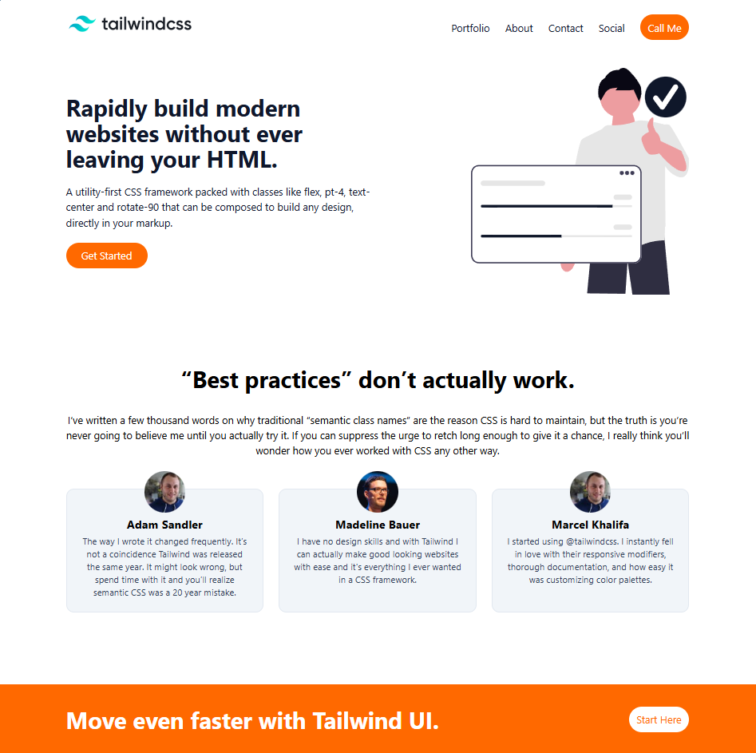

# Landing Page

This project is a responsive landing page built with **Tailwind CSS**.
It focuses on a clean layout, fast styling workflow, and mobile-friendly design.

## Project Overview

The goal of this project was to create a modern front-end landing page and style it using the utility-first approach from Tailwind CSS. The page structure is written in HTML and the styling is handled through Tailwind-generated CSS.

## Technologies Used

- HTML5
- Tailwind CSS
- CSS (custom stylesheet alongside generated output)

## Screenshot

Below is the screenshot added for this project:

